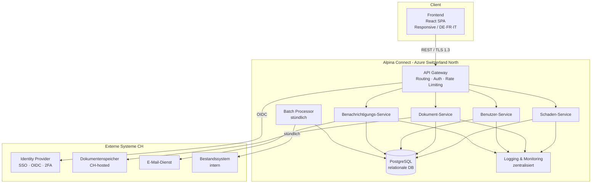

# Architektur — Alpina Connect

**Projekt:** Alpina Connect — Digitales Kundenportal
**Version:** 1.0
**Datum:** 27. April 2026
**Autorin:** Kathrin Textor
**Auftraggeber:** Alpina Versicherungen AG

---

## Artefakt 1 — Architekturüberblick

### Architekturprinzipien

| Prinzip | Umsetzung |
|---|---|
| **Boring Technology** | Bewährte, stabile Technologien — kein Experiment im Produktivbetrieb |
| **Security by Design** | TLS 1.3, SSO/2FA, keine sensiblen Daten im Frontend |
| **Data Residency** | Alle Daten ausschliesslich in der Schweiz (Azure Switzerland North oder AWS Zürich) |
| **Separation of Concerns** | Klare Verantwortungsgrenzen zwischen Layern und Services |
| **Fail Gracefully** | Stündliche Batch-Verarbeitung statt fragiler Echtzeit-Kopplung (MVP) |

---

### Systemkontext (C4 Level 1)

```
        ┌──────────────┐
        │   Endkunde   │
        └──────┬───────┘
               │ HTTPS / TLS 1.3 (Browser)
               ▼
  ┌────────────────────────┐
  │                        │
  │    ALPINA CONNECT      │◄── SSO/2FA ──► ┌──────────────────┐
  │    (Web Portal)        │                │ Identity Provider │
  │                        │                └──────────────────┘
  └────────────┬───────────┘
               │
       ┌───────┼──────────────────┐
       ▼       ▼                  ▼
┌──────────┐ ┌──────────────┐ ┌──────────┐
│Bestands- │ │  Dokumenten- │ │  E-Mail- │
│system    │ │  speicher    │ │  Dienst  │
│(intern)  │ │  (CH-hosted) │ │          │
└──────────┘ └──────────────┘ └──────────┘
```

---

### Container-Architektur (C4 Level 2)



---

### Technologie-Stack

| Schicht | Technologie | Begründung |
|---|---|---|
| Frontend | React 18 + TypeScript | Stabil, guter i18n-Support |
| API Gateway | Kong / AWS API Gateway | Bewährt, Sicherheitsfunktionen out-of-the-box |
| Backend Services | Java 21 (Spring Boot) | Enterprise-erprobt, typsicher |
| Datenbank | PostgreSQL 16 | ACID-konform, CH-hosted verfügbar |
| Dokumentenspeicher | Azure Blob Storage (Switzerland North) | CH-Datenresidenz, max. 10 MB/Datei |
| Auth | OAuth 2.0 / OIDC + TOTP 2FA | Industriestandard |
| Batch | Spring Batch | Stündliche Sync mit Bestandssystem |
| Kommunikation | REST/JSON + TLS 1.3 | Einfach, gut toolunterstützt |

---

## Artefakt 2 — Schnittstellenübersicht

| ID | Schnittstelle | Konsument | Produzent | Protokoll | Auth | Typ |
|---|---|---|---|---|---|---|
| IF-01 | Portal-API | Frontend | Backend | REST / HTTPS / TLS 1.3 | JWT Bearer | synchron |
| IF-02 | Bestandssystem-Adapter | Batch Processor | Bestandssystem (intern) | REST / HTTPS | API-Key / Zertifikat | batch (stündlich) |
| IF-03 | Dokumentenspeicher-API | Dokument-Service | Externer Speicher (CH) | REST / HTTPS / TLS 1.3 | OAuth 2.0 | synchron |
| IF-04 | E-Mail-Dienst | Benachrichtigungs-Service | E-Mail-Provider | REST API / SMTP TLS | API-Key | asynchron |
| IF-05 | SSO / Identity Provider | API Gateway | OIDC Provider | OIDC / OAuth 2.0 | Client Credentials | synchron |
| IF-06 | Logging / Monitoring | Alle Backend-Services | Zentrales Log-System | OpenTelemetry / HTTPS | mTLS | asynchron |

### IF-01 — Portal-API (Detail)

| Attribut | Wert |
|---|---|
| **Protokoll** | HTTPS / TLS 1.3 |
| **Format** | JSON (REST) |
| **Authentifizierung** | JWT Bearer Token (ausgestellt durch SSO) |
| **Versionierung** | URL-Pfad (`/api/v1/...`) |
| **Mehrsprachigkeit** | `Accept-Language`-Header (de/fr/it) |

Relevante Endpunkte:
```
GET    /api/v1/cases              → Liste aller Schadensfälle
GET    /api/v1/cases/{id}         → Detailansicht eines Falls
POST   /api/v1/cases              → Neuen Schadensfall einreichen
POST   /api/v1/cases/{id}/documents → Dokument hochladen (max. 10 MB)
GET    /api/v1/cases/{id}/status  → Aktuellen Status abrufen
GET    /api/v1/user/profile       → Benutzerprofil abrufen
```

### IF-02 — Bestandssystem-Adapter (Detail)

| Attribut | Wert |
|---|---|
| **Typ** | Batch (stündlich) |
| **Synchronisationsrichtung** | Bidirektional (Statusupdates rein; neue Fälle raus) |
| **Fehlerbehandlung** | Dead-Letter-Queue; Retry 3×; Alert bei Ausfall |

### IF-05 — SSO / Identity Provider (Detail)

| Attribut | Wert |
|---|---|
| **Flow** | Authorization Code + PKCE (Frontend) |
| **2FA** | TOTP (Authenticator App) oder SMS OTP |
| **Token-Lebensdauer** | Access Token: 15 Min; Refresh Token: 8 h |

---

## Artefakt 3 — Technische Rahmenbedingungen

| ID | Rahmenbedingung | Priorität | Begründung |
|---|---|---|---|
| RB-01 | Alle Daten in der Schweiz (Azure Switzerland North / AWS Zürich) | MUSS | nDSG, DSGVO |
| RB-02 | Kein Native App; responsive Web App | MUSS | Scope-Entscheidung |
| RB-03 | Stündliche Batch-Sync mit Bestandssystem (MVP) | MUSS | Technische Limitierung Bestandssystem |
| RB-04 | TLS 1.3 für alle Verbindungen | MUSS | Sicherheitsstandard |
| RB-05 | SSO + verpflichtendes 2FA für alle Benutzer | MUSS | Authentifizierungsrichtlinie |
| RB-06 | Keine PII in Log-Ausgaben | MUSS | DSGVO / nDSG |
| RB-07 | Max. 10 MB pro Datei, max. 50 MB pro Schadensfall | MUSS | IT-Infrastrukturvorgabe |
| RB-08 | Relationale Datenbank als primärer Datenspeicher | MUSS | Datenintegrität, ACID |
| RB-09 | Audit-Logs 7 Jahre aufbewahren | MUSS | Gesetzliche Anforderung CH (OR) |
| RB-10 | UI in DE, FR, IT | MUSS | Schweizer Mehrsprachigkeit |
| RB-11 | WCAG 2.1 Level AA | SOLL | Zugänglichkeit |
