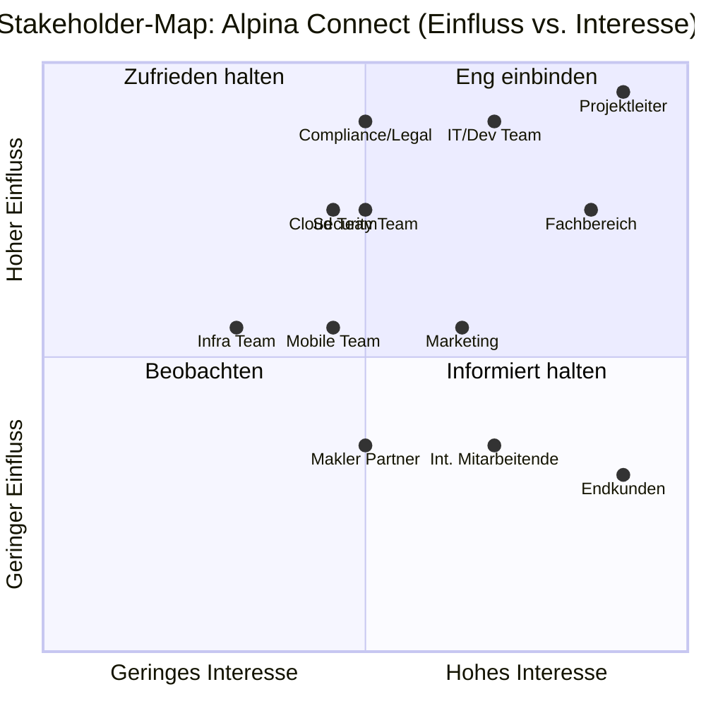

# Stakeholderübersicht & Stakeholder-Map — Alpina Connect

**Projekt:** Alpina Connect — Digitales Kundenportal
**Version:** 1.0
**Datum:** 27. April 2026
**Autorin:** Kathrin Textor
**Auftraggeber:** Alpina Versicherungen AG

---

## Artefakt 1 — Stakeholderübersicht

| # | Stakeholder | Rolle / Typ | Kerninteressen | Einfluss (1–5) | Interesse (1–5) | Haltung | Einbindungsstrategie |
|---|---|---|---|---|---|---|---|
| 1 | Projektleiter | Intern / Auftraggeber | Termin, Budget, Qualität | 5 | 5 | Unterstützend | Enger Austausch, regelmäßige Statusberichte |
| 2 | Fachbereich | Intern / Key User | Digitalisierung, einfache Bedienung, Mehrsprachigkeit | 4 | 5 | Unterstützend | Workshops, Anforderungsreviews, UAT |
| 3 | IT/Dev Team | Intern / Umsetzer | Technische Machbarkeit, Batch, Wartbarkeit | 5 | 4 | Neutral–kritisch | Sprint-Reviews, technische Abstimmungen |
| 4 | Compliance/Legal | Intern / Kontrolleur | DSGVO, nDSG, Schweizer Datenhaltung | 5 | 3 | Neutral | Compliance-Reviews, Sign-Off |
| 5 | Security Team | Intern / Kontrolleur | SSO, kein anonymer Zugriff, Datensicherheit | 4 | 3 | Neutral–kritisch | Security-Reviews, Penetrationstests |
| 6 | Marketing | Intern / Beeinflusser | Mobile-First, UX, Markenkonsistenz | 3 | 4 | Unterstützend | UX-Reviews, Prototypen-Feedback |
| 7 | Cloud Team | Intern / Beeinflusser | Kostenoptimierung, Skalierbarkeit | 4 | 3 | Unterstützend | Architektur-Reviews |
| 8 | Mobile Team | Intern / Berater | PWA, kein Native App | 3 | 3 | Neutral | Technische Beratung |
| 9 | Infrastructure Team | Intern / Betrieb | Upload-Limit (10 MB), Stabilität | 3 | 2 | Neutral | Infrastruktur-Reviews, SLA-Definition |
| 10 | Endkunden (Privatkunden) | Extern / Primärnutzer | Einfache Meldung, Statusverfolgung, Mehrsprachigkeit | 2 | 5 | Unterstützend | User Research, Usability-Tests |
| 11 | Interne Mitarbeitende | Intern / Sekundärnutzer | Effiziente Bearbeitung, klare Workflows | 2 | 4 | Neutral | Interviews, Prozessworkshops |
| 12 | Makler / Partner | Extern / Zukünftig | Portalzugang, Kundentransparenz (Phase 2) | 2 | 3 | Offen | Roadmap-Kommunikation |

**Legende:** Einfluss/Interesse: 1 = gering, 5 = sehr hoch

---

## Artefakt 2 — Stakeholder-Map (Einfluss/Interesse-Matrix)

### Ableitungen aus der Matrix

| Quadrant | Stakeholder | Maßnahme |
|---|---|---|
| **Eng einbinden** (hoch/hoch) | Projektleiter, Fachbereich, IT/Dev | Regelmäßige Meetings, Entscheidungen gemeinsam treffen |
| **Zufrieden halten** (hoch/gering) | Compliance/Legal, Security, Cloud Team | Meilensteinreviews, Freigaben einholen |
| **Informiert halten** (gering/hoch) | Endkunden, Int. Mitarbeitende | Newsletter, Testzugänge, UAT-Phasen |
| **Beobachten** (gering/gering) | Mobile Team, Infra Team, Makler | Regelmäßige Updates, Roadmap kommunizieren |
