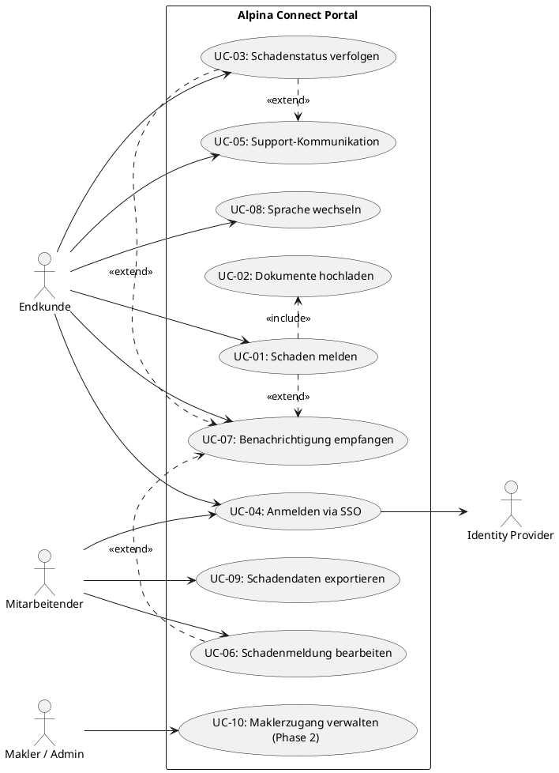
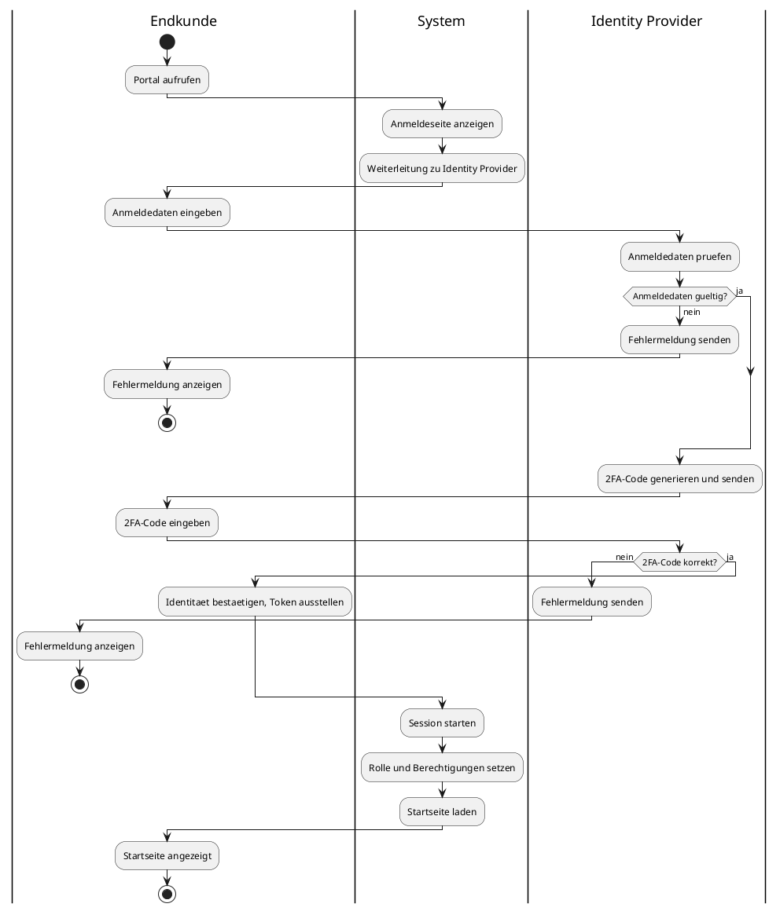
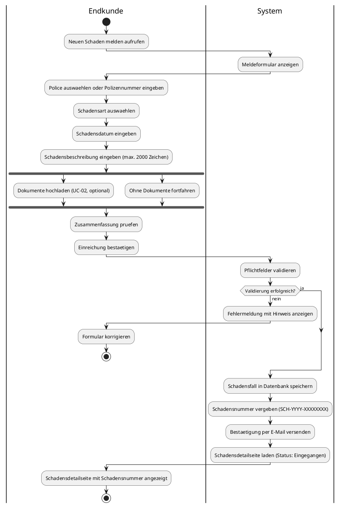
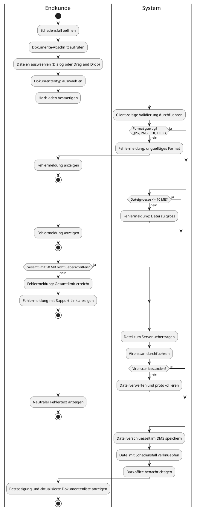
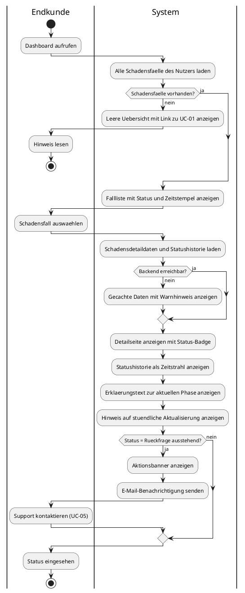
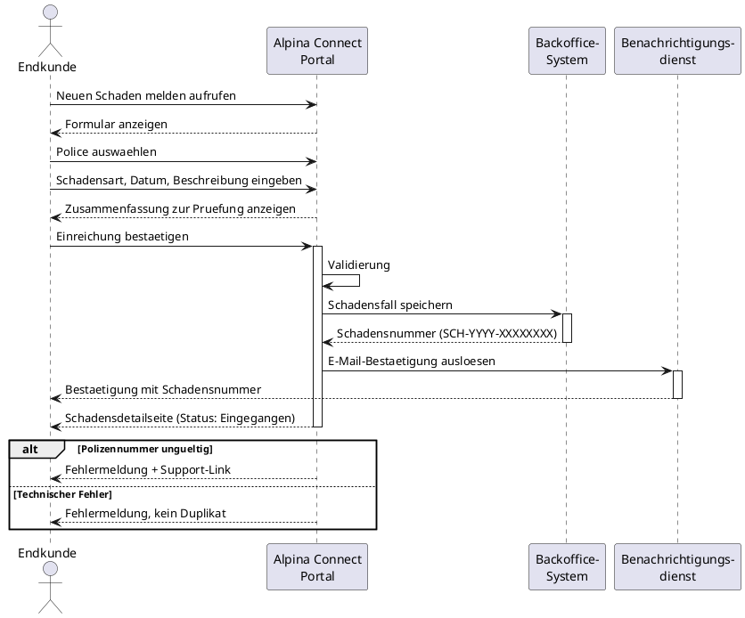
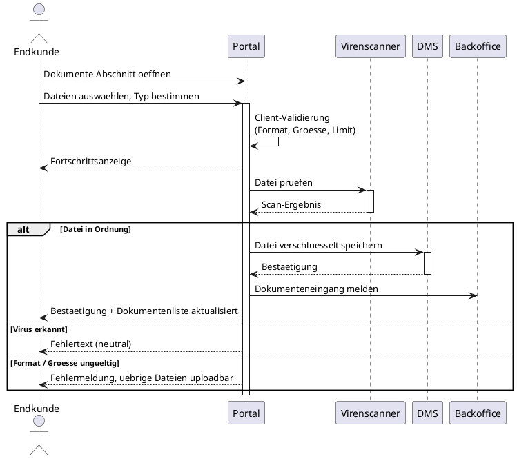

# UML-Diagramme — Alpina Connect

**Projekt:** Alpina Connect — Digitales Kundenportal
**Version:** 1.0
**Datum:** 2026-05-04
**Autorin:** Kathrin Textor
**Notation:** UML 2.x Standard (PlantUML)

> **Rendering:** Diagramme unter [plantuml.com/plantuml](https://www.plantuml.com/plantuml/uml/) einfügen
> oder in Draw.io: Extras → Diagramm bearbeiten → Format "PlantUML"

---

## 1. Use-Case-Diagramm (Übersicht)

---

## 2. Aktivitätsdiagramm — UC-04: Anmelden via SSO

---

## 3. Aktivitätsdiagramm — UC-01: Schaden melden

---

## 4. Aktivitätsdiagramm — UC-02: Dokumente hochladen

---

## 5. Aktivitätsdiagramm — UC-03: Schadenstatus verfolgen

---

## 6. Sequenzdiagramm — UC-01: Schaden melden

> Sequenzdiagramme zeigen die zeitliche Abfolge der Nachrichten zwischen Beteiligten.

---

## 7. Sequenzdiagramm — UC-02: Dokumente hochladen

---

## Rendering-Optionen

| Methode | Anleitung |
|---|---|
| **Online (PlantUML)** | [plantuml.com/plantuml](https://www.plantuml.com/plantuml/uml/) — Code einfügen, direkt gerendert |
| **Draw.io** | Extras → Diagramm bearbeiten → Format "PlantUML" → Code einfügen → OK |
| **VS Code** | Extension "PlantUML" installieren → `.puml`-Datei → Vorschau mit `Alt+D` |
