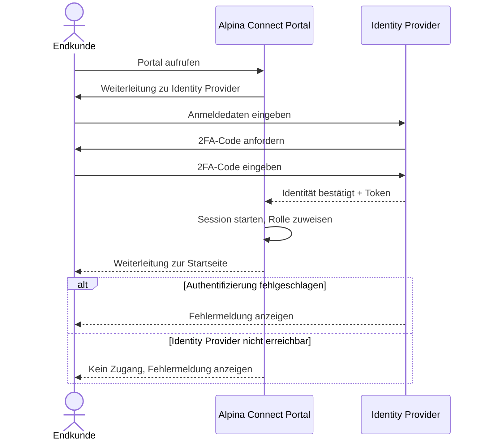
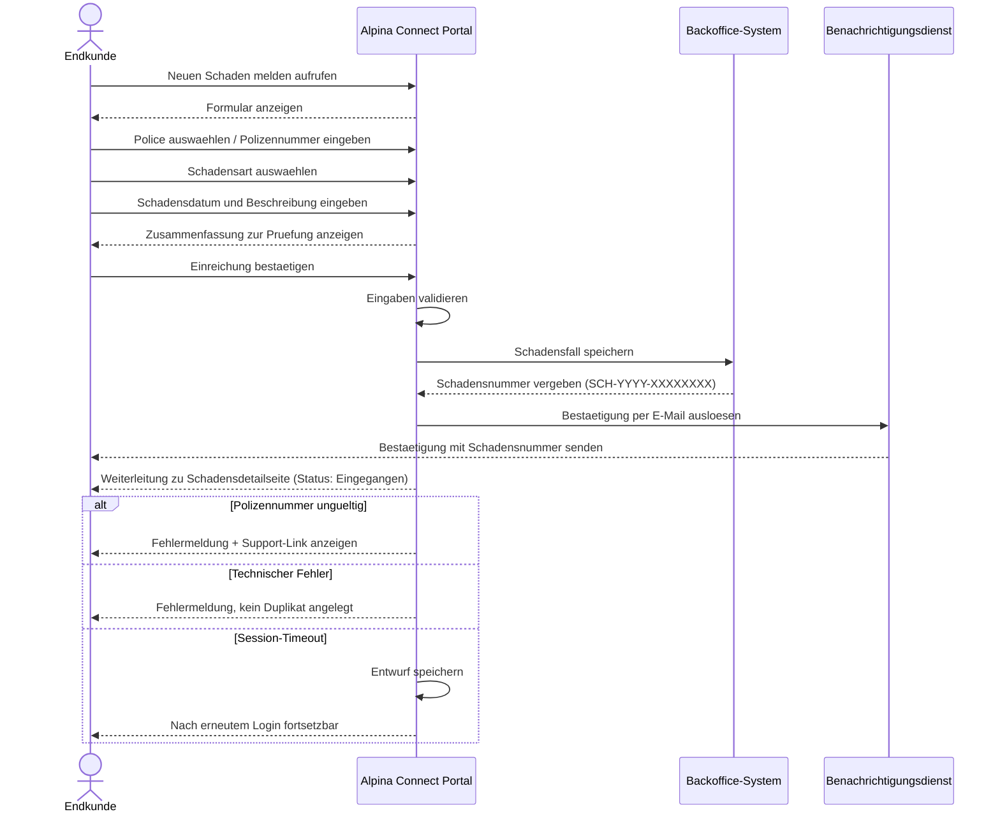
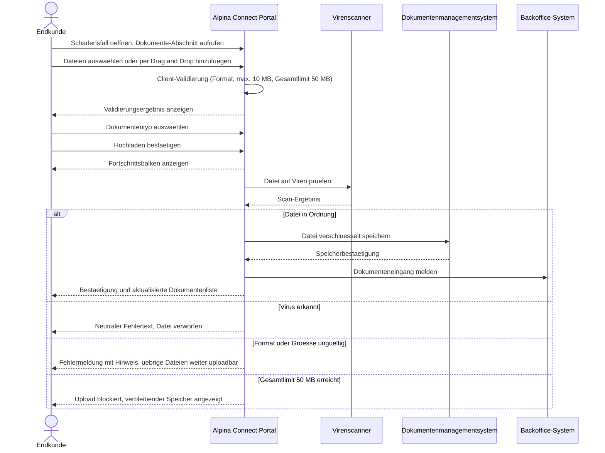
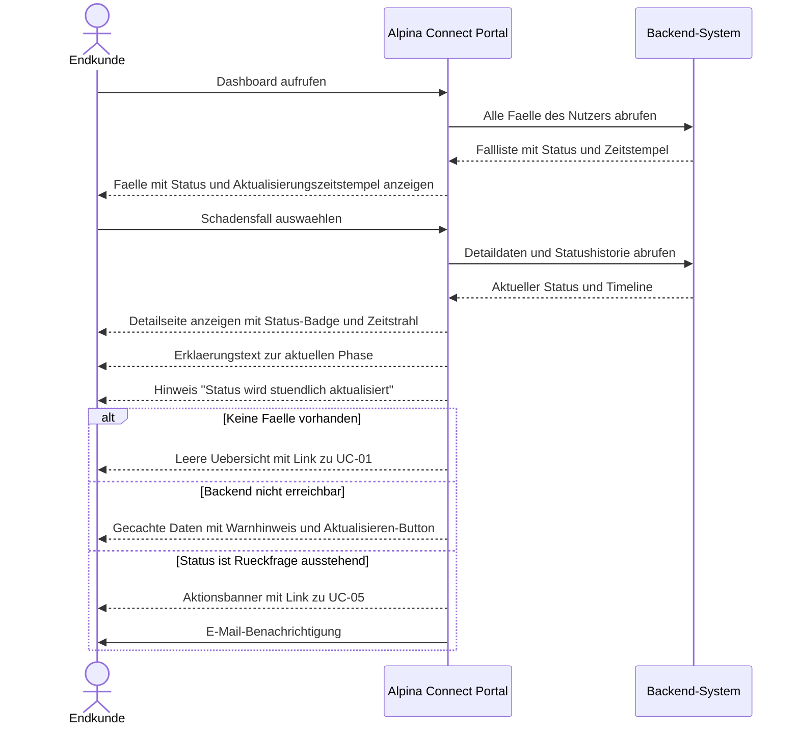

# UML Sequenzdiagramme — Alpina Connect

**Projekt:** Alpina Connect — Digitales Kundenportal
**Version:** 1.0
**Datum:** 2026-05-04
**Autorin:** Kathrin Textor
**Erstellt mit:** Claude Code (Mermaid) → Draw.io (Rendering)

---

## UC-04: Anmelden via SSO

> Vorbedingung für alle anderen Use Cases — deshalb zuerst dargestellt.

---

## UC-01: Schaden melden

> Setzt UC-04 (Anmeldung) voraus.

---

## UC-02: Dokumente hochladen

> Setzt UC-01 (Schadensfall vorhanden) voraus.

---

## UC-03: Schadenstatus verfolgen

> Setzt UC-01 (Schadensfall vorhanden) voraus.

---

## Legende

| Symbol | Bedeutung |
|---|---|
| `->>` | Synchrone Nachricht (Anfrage) |
| `-->>` | Antwort / Rueckgabe |
| `actor` | Menschlicher Akteur |
| `participant` | System / Dienst |
| `alt` | Alternative Ablaufpfade |
