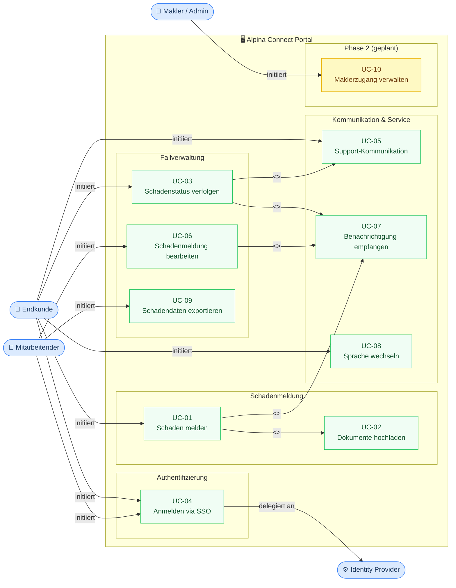

# UML Use-Case-Diagramm — Alpina Connect

**Projekt:** Alpina Connect — Digitales Kundenportal
**Version:** 1.0
**Datum:** 2026-05-04
**Autorin:** Kathrin Textor
**Erstellt mit:** Claude Code (Mermaid-Code-Generierung) → Draw.io (Rendering)

---

## Use-Case-Diagramm (Mermaid)

> Dieses Diagramm kann in [Draw.io](https://app.diagrams.net/) importiert werden:
> Extras → Diagramm bearbeiten → Mermaid-Code einfügen

---

## Use-Case-Übersicht

| UC-ID | Use Case | Akteur | Priorität | Beziehung |
|---|---|---|---|---|
| UC-01 | Schaden melden | Endkunde | MUSS | `<<include>>` UC-02 |
| UC-02 | Dokumente hochladen | Endkunde | MUSS | — |
| UC-03 | Schadenstatus verfolgen | Endkunde | MUSS | `<<extend>>` UC-05, UC-07 |
| UC-04 | Anmelden via SSO | Endkunde / Mitarbeitender | MUSS | delegiert an Identity Provider |
| UC-05 | Support-Kommunikation | Endkunde | SOLL | — |
| UC-06 | Schadenmeldung bearbeiten | Mitarbeitender | MUSS | `<<extend>>` UC-07 |
| UC-07 | Benachrichtigung empfangen | Endkunde | SOLL | — |
| UC-08 | Sprache wechseln | Endkunde | SOLL | — |
| UC-09 | Schadendaten exportieren | Mitarbeitender | KANN | — |
| UC-10 | Maklerzugang verwalten | Makler / Admin | ZUKUNFT | Phase 2 |

---

## Legende

| Symbol | Bedeutung |
|---|---|
| `<<include>>` | Eingebundener Use Case — wird immer ausgeführt |
| `<<extend>>` | Erweiternder Use Case — wird unter bestimmten Bedingungen ausgeführt |
| 🟦 Blau | Akteure (extern) |
| 🟩 Grün | Use Cases (MVP Phase 1) |
| 🟨 Gelb | Use Cases (Phase 2 / Zukunft) |

---

## Import in Draw.io

1. [app.diagrams.net](https://app.diagrams.net/) öffnen
2. **Extras** → **Diagramm bearbeiten**
3. Mermaid-Code aus dem Codeblock oben einfügen
4. **OK** — Diagramm wird automatisch gerendert
5. Layout nach Bedarf anpassen und als SVG/PNG exportieren
