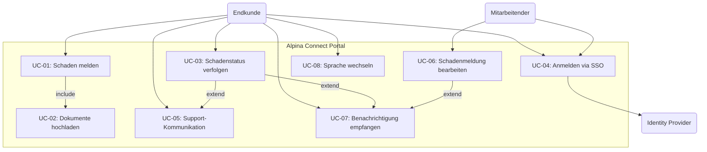

# Use Cases — Alpina Connect

**Projekt:** Alpina Connect — Digitales Kundenportal
**Version:** 1.0
**Datum:** 27. April 2026
**Autorin:** Kathrin Textor
**Auftraggeber:** Alpina Versicherungen AG

---

## UC-Übersicht

| UC-ID | Use Case | Primärer Akteur | Priorität |
|---|---|---|---|
| UC-01 | Schaden melden | Endkunde | MUSS |
| UC-02 | Dokumente hochladen | Endkunde | MUSS |
| UC-03 | Schadenstatus verfolgen | Endkunde | MUSS |
| UC-04 | Am Portal anmelden (SSO) | Endkunde / Mitarbeitender | MUSS |
| UC-05 | Support-Kommunikation führen | Endkunde | SOLL |
| UC-06 | Schadenmeldung bearbeiten | Interner Mitarbeitender | MUSS |
| UC-07 | Benachrichtigung empfangen | Endkunde | SOLL |
| UC-08 | Sprache wechseln | Endkunde | SOLL |
| UC-09 | Schadendaten exportieren (Batch) | Interner Mitarbeitender | KANN |
| UC-10 | Maklerzugang verwalten | Makler / Admin | ZUKUNFT |

---

## UC-01 — Schaden melden

| Attribut | Beschreibung |
|---|---|
| **Ziel** | Endkunde meldet einen Versicherungsschaden vollständig digital |
| **Akteure** | Primär: Endkunde — Sekundär: IT-System |
| **Vorbedingung** | Kunde ist angemeldet (UC-04); Kundenvertrag existiert |
| **Nachbedingung (Erfolg)** | Meldung gespeichert, Referenznummer vergeben, Bestätigung per E-Mail |
| **Nachbedingung (Fehlschlag)** | Meldung nicht gespeichert, Fehlermeldung angezeigt |
| **Standardablauf** | 1. Kunde wählt "Neuen Schaden melden" → 2. System zeigt Formular → 3. Kunde füllt Pflichtfelder aus → 4. Kunde lädt optional Dokumente hoch (UC-02) → 5. Kunde bestätigt → 6. System validiert → 7. Referenznummer wird vergeben → 8. Bestätigung per E-Mail |
| **Alternativablauf** | 3a. Pflichtfelder fehlen → Inline-Validierungsfehler, zurück zu Schritt 3 |
| **Ausnahmen** | 6a. Systemfehler → Fehlermeldung angezeigt |
| **Besonderheiten** | Mehrsprachig (DE/FR/IT); Mobile-First; Polizennummer-Zuordnung verpflichtend |

---

## UC-02 — Dokumente hochladen

| Attribut | Beschreibung |
|---|---|
| **Ziel** | Endkunde lädt Belege und Fotos zu einem Schadensfall hoch |
| **Akteure** | Primär: Endkunde — Sekundär: IT-System |
| **Vorbedingung** | Kunde ist angemeldet; Schadensfall existiert |
| **Nachbedingung (Erfolg)** | Dokument gespeichert und dem Schadensfall zugeordnet |
| **Nachbedingung (Fehlschlag)** | Upload abgewiesen, Fehlermeldung angezeigt |
| **Standardablauf** | 1. Kunde wählt "Dokument hochladen" → 2. Dateiauswahl (Einzeln oder Mehrfach) → 3. Client-seitige Validierung (Format, Größe) → 4. Upload zum externen Speicherdienst → 5. Bestätigung angezeigt |
| **Alternativablauf** | 3a. Datei > 10 MB → Abweisung mit Fehlermeldung; 3b. Falsches Format → Abweisung |
| **Besonderheiten** | Max. 10 MB/Datei; max. 50 MB/Schadensfall; Formate: JPG, PNG, PDF, HEIC |

---

## UC-03 — Schadenstatus verfolgen

| Attribut | Beschreibung |
|---|---|
| **Ziel** | Kunde erhält transparenten Überblick über Bearbeitungsstatus |
| **Akteure** | Primär: Endkunde — Sekundär: IT-System |
| **Vorbedingung** | Kunde ist angemeldet; mindestens eine Meldung existiert |
| **Nachbedingung (Erfolg)** | Aktueller Status korrekt angezeigt |
| **Standardablauf** | 1. Kunde wählt "Meine Schäden" → 2. System listet alle Fälle mit Status → 3. Kunde wählt einen Fall → 4. Detailansicht: Status-Timeline, Dokumente → 5. Optional: Support kontaktieren (UC-05) |
| **Alternativablauf** | 2a. Keine Meldungen vorhanden → Hinweis mit Link zu UC-01 |
| **Besonderheiten** | Statusaktualisierung max. 60 Min. Verzögerung; Timestamp "Zuletzt aktualisiert" sichtbar |

---

## UC-04 — Am Portal anmelden (SSO)

| Attribut | Beschreibung |
|---|---|
| **Ziel** | Benutzer authentifiziert sich sicher über SSO |
| **Akteure** | Primär: Endkunde / Mitarbeitender — Sekundär: Identity Provider |
| **Vorbedingung** | Benutzer besitzt gültiges Konto beim Identity Provider |
| **Nachbedingung (Erfolg)** | Session gestartet, rollenbasierter Zugang gewährt |
| **Nachbedingung (Fehlschlag)** | Zugang verweigert, Fehlermeldung angezeigt |
| **Standardablauf** | 1. Benutzer ruft Portal auf → 2. Weiterleitung zum IdP → 3. Authentifizierung inkl. 2FA → 4. IdP bestätigt Identität → 5. Session gestartet → 6. Weiterleitung zur Startseite |
| **Ausnahmen** | 3a. Auth schlägt fehl → Fehlermeldung; 3b. IdP nicht erreichbar → kein Zugang |
| **Besonderheiten** | SSO einziger Authentifizierungsweg; kein anonymer Zugriff |

---

## UC-05 — Support-Kommunikation führen

| Attribut | Beschreibung |
|---|---|
| **Ziel** | Kunde nimmt Kontakt mit dem Kundendienst auf |
| **Akteure** | Primär: Endkunde — Sekundär: Sachbearbeiter, IT-System |
| **Vorbedingung** | Kunde ist angemeldet |
| **Nachbedingung (Erfolg)** | E-Mail mit Referenznummer an Kundendienst versendet |
| **Standardablauf** | 1. Kunde wählt "Support kontaktieren" → 2. System prefüllt Referenznummer → 3. Kunde verfasst Nachricht → 4. System sendet E-Mail an Kundendienst → 5. Bestätigung angezeigt |
| **Besonderheiten** | MVP: nur E-Mail; Chat in Phase 2 |

---

## Use Case Diagramm

